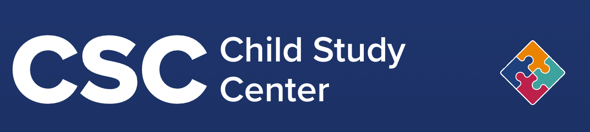

## Welcome! Please check in

```{r}
#| label: checkin-qr-code
#| echo: false
#| fig-align: "center"

plot(qrcode::qr_code("https://pennstate.qualtrics.com/jfe/form/SV_5vdpIekRnWpfsBo"))
```

## Introductions

- Directors
- [Program committee](program-committee.qmd)

## Logistics

- Food
- Bathrooms
- Space

## Schedule

- [Day 1](day-1.qmd)
- [Day 2](day-2.qmd)

## Why are *you* here?

::: {.fragment}
{fig-align="center" width="60%"}
:::

## Why are *we* here?

:::: {.columns}
::: {.column width=50%}
::: {.incremental}
- Open is cool
- Open is fun
- Open is the future

:::
:::
::: {.column width=50%}
{width="80%" fig-align="right"}
:::
::::

## Thank you, sponsors!

:::::: columns
::: {.column width="50%"}
{fig-align="center"}
:::
::: {.column width="50%"}
{fig-align="center"}
:::
::::::

:::: {.columns}
::: {.column width=50%}
{fig-align="center"}
:::
::: {.column width=50%}
{fig-align="center"}
:::
::::

:::: {.columns}
::: {.column width=50%}
{fig-align="center"}
:::
::: {.column width=50%}
{fig-align="center"}
:::
::::
