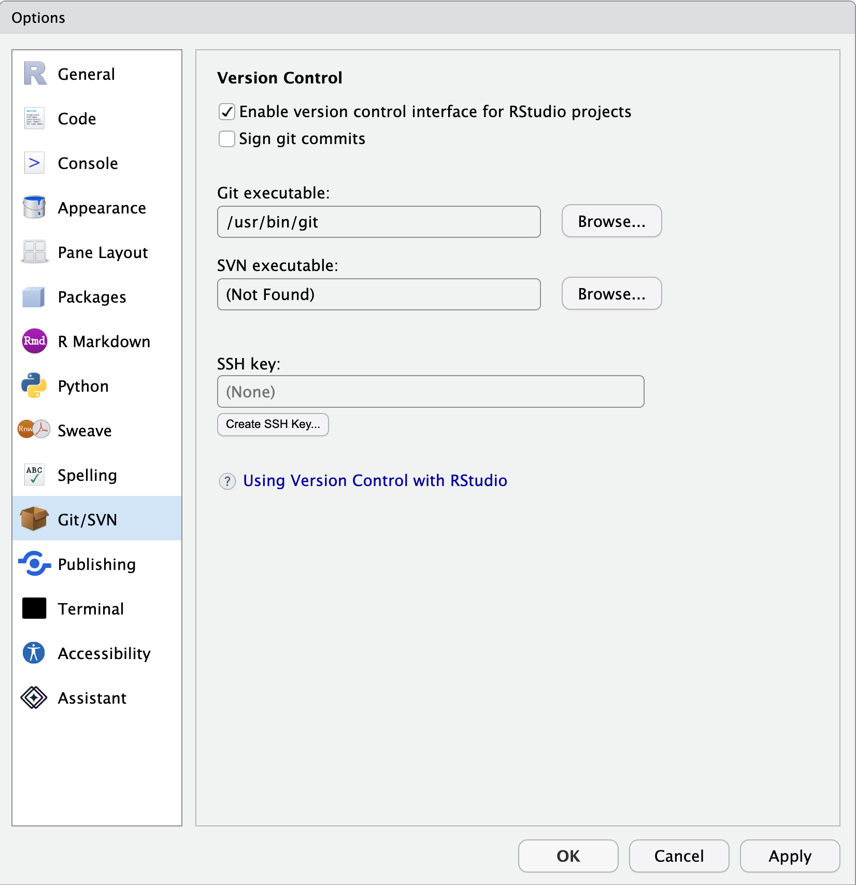

## About

This page briefly describes how to install RStudio and Quarto on your personal computer.

If you plan to attend either the [Quarto I](sessions.qmd#quarto-part-i-a-tool-for-open-scholarship) or [Quarto II](sessions.qmd#quarto-part-ii-reproducible-research-reports) workshops, please follow these steps *before* the Bootcamp.

## Install R

## (Optional) Install git

The version control package git may not be installed on your Windows machine. 
It is usually installed by default on Mac OS.

If git is not installed, follow these instructions for installing git on your system are [here](https://happygitwithr.com/install-git). 

You can use R, RStudio, and Quarto without using git, but there are good reasons to consider using it.

If you decide to use the web-based git code sharing service called [GitHub](https://github.com) with RStudio, you will want to follow the excellent instructions [here](https://happygitwithr.com).

## Install RStudio

## Install Quarto

## Launch RStudio

Confirm that R Studio can access git by opening Tools/Global Options menu item.

Select Git/SVN from the left panel.
Confirm that "Enable version control interface for RStudio projects" is checked and that there is an entry in the box under "Git executable:".

## References
