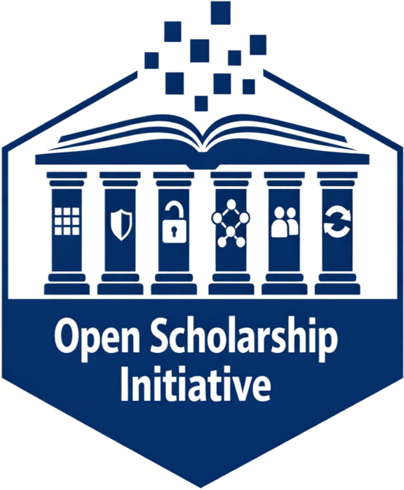

## About

:::: {.columns}
::: {.column width=20%}

:::
::: {.column width=5%}
:::
::: {.column width=75%}
This page provides an overview about what is happening and when over the two-day bootcamp.
See the detailed daily schedules for more specific information about times and locations.
:::
::::

## Overview

### [Day 1](day-1.qmd)

*Breakfast provided*  

*Orientation*: [Rick Gilmore](directors.qmd#rick-gilmore) and [Alaina Pearce](directors.qmd#alaina-pearce)

*Welcome*: [Nathan Hall](presenters.qmd#nathan-f-hall), Penn State Libraries

*Presentation*: Research Data Stewardship Program, [Briana Wham](program-committee.qmd#briana-wham)

*Keynote*: Responsible science at scale: Lessons for everyone from baby research and (really) large collaborations, [Melissa Kline Struhl](presenters.qmd#melissa-kline-struhl), Director, Children Helping Science

*Lunch provided*  

*Discussion*: Uses and misuses open research data

*Hands-on workshops*

::: {.callout-note}
### Social Event  

Early career scholar gathering.
:::

### [Day 2](day-2.qmd)

*Breakfast provided*  

*Hands-on workshops*

*Lunch provided*  

*Panel Discussion*: Open research data and AI ethics 

*Hands-on workshops*

::: {.callout-note}
### Social Event  

End of bootcamp reception @ The Lobby Bar.
:::
